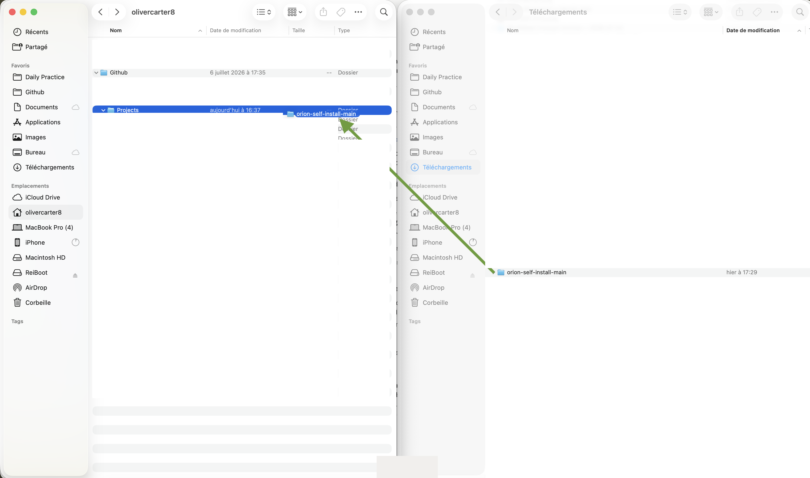
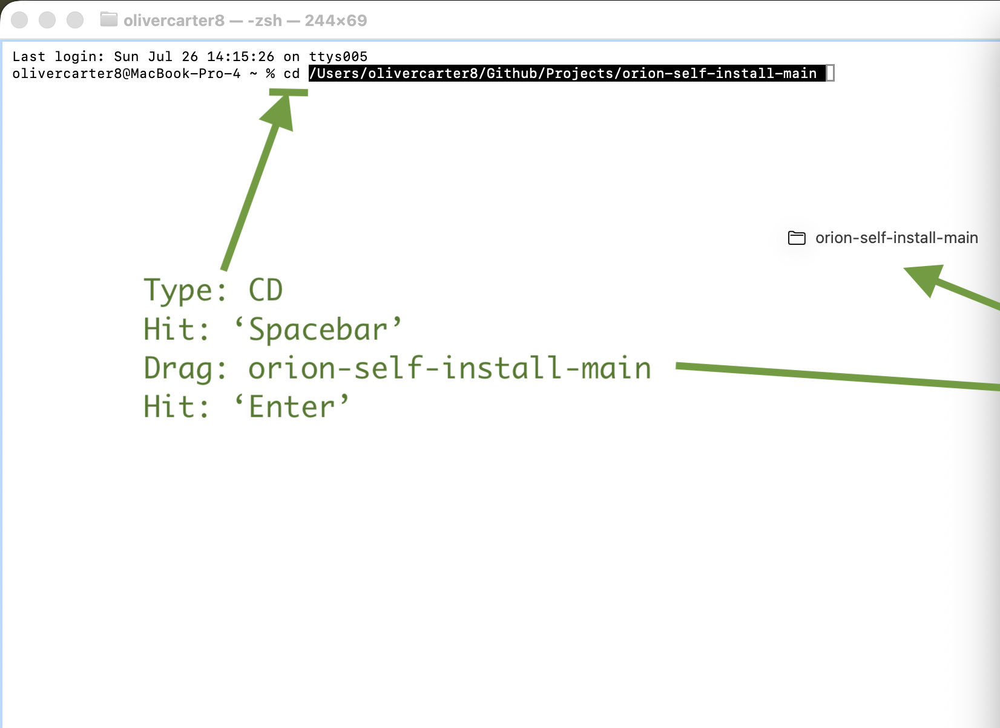
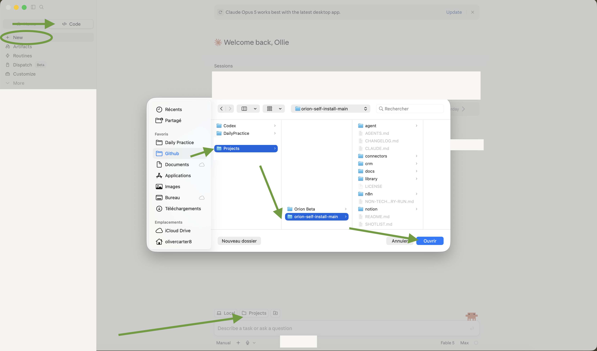
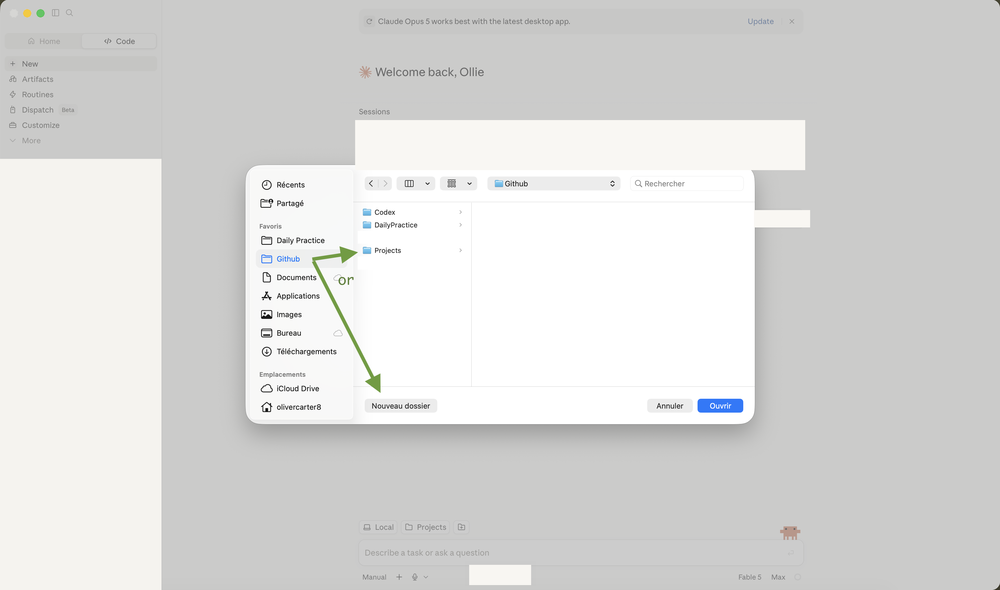

# Orion — turn your own AI assistant into your sales agent

Orion is a personal sales agent that learns your business, your customers, and how you
actually sell — then takes on the parts of selling that aren't talking to people. You
tell it about a prospect; it researches them and drafts a message for you to look over.
After a call, you tell it how it went; it writes the summary, updates your pipeline, and
drafts your follow-up — all as drafts waiting for you, never sent on their own.

There's no coach or consultant involved. Your own AI assistant — Claude, ChatGPT,
Copilot, Codex, whichever you already use — installs it with you, using the files in
this folder. This page is the control panel: **Press Start** below gets you going in
three small moves; **the Library** underneath it is where you add capabilities, today or
months from now.

**Three things worth knowing before you start:**

- **You don't need to know how to code, and you don't need to install anything new**
  beyond an AI assistant you probably already have.
- **This usually takes a few sittings, not one.** You can stop anytime — see
  ["You can stop anytime"](#you-can-stop-anytime-and-pick-up-right-where-you-left-off)
  below — and nothing is lost.
- **Nothing happens without you saying yes.** Not one email, not one change to your
  contacts list, ever, without you approving it first. More on this below.

---

## ▶ Press Start

Three moves, a few minutes, and your AI takes over:

1. **Get the files** — download and unzip this folder
   ([Step 1](#step-1--get-the-files-onto-your-computer)).
2. **Give it a home** — move the folder out of Downloads to where it will live
   ([Step 2](#step-2--move-it-to-its-home)).
3. **Run one line** — open a terminal in that folder and run:

```bash
node start.mjs
```

That one line wakes a setup wizard that does the looking-around for you: what computer
this is, which AI tools already live on it, what's missing. It asks at most a question
or two (only the ones a machine genuinely can't answer), never asks you to put a
password in the chat, and ends by handing you the exact prompt that starts your AI on
the install. [Step 3](#step-3--press-start) walks the "open a terminal" part
click by click — it's easier than it sounds.

**You'll know it worked when**: the window shows "Orion — Press Start" and starts
talking to you in plain words.

**If that didn't work** — say the window says something like `command not found: node`
— your computer doesn't have Node.js, a free tool the wizard runs on. **You don't need
it.** The wizard is a fast lane, not the only door:
[Step 4](#step-4--open-orion-with-your-ai-assistant) reaches every same outcome by
plain conversation with your AI, and it always works.

---

## 📚 The Library — add capabilities anytime

Honest mechanics: on this website a "button" is a link. Each one opens a package page
whose **first block is the exact text to paste into your AI** — your AI installs it
from there, fits it to your business, and proves it works on your real data.

**Agents** — a colleague with a job:

- **[Prospecting](library/agents/prospecting/PACKAGE.md)** — ~20 researched
  candidates that match your ideal customer, each with a one-line "why them."
- **[Call-Planner Control Tower](library/agents/call-planner/PACKAGE.md)** — who to
  call today, in what order, with context and the angle.
- **[Friday Report](library/agents/friday-report/PACKAGE.md)** — the week's honest
  scoreboard, drafted for your approval.

**Skills** — one teachable capability:

- **[Meeting Sizing](library/skills/meeting-sizing/PACKAGE.md)** — every meeting gets
  an outcome, a decision-maker, and the shortest useful length.

**Workflows** — automated chains, gated on your yes:

- **[Prospect Research → Outreach](library/workflows/prospect-research-outreach/PACKAGE.md)**
  — form in, researched draft out, waiting in your Drafts.
- **[Post-Call Debrief](library/workflows/post-call-debrief/PACKAGE.md)** — call notes
  in; summary, CRM update and follow-up draft out.

**Programs** — operating routines your agent runs with you:

- **[Revenue Operating Cadence](library/programs/revenue-operating-cadence/PACKAGE.md)**
  — the daily/weekly/monthly beat that moves revenue from attention to collected cash.

More about how packages work (and what "installed" honestly means):
[the Library's own page](library/README.md).

---

## Step 1 — Get the files onto your computer

Everything Orion needs is bundled into what's called a **repository** (or "repo" for
short) — really just a folder of files, sitting on a website called GitHub. You need your
own copy of that folder on your own computer.

<!-- SCREENSHOT: docs/img/01-github-code-button.png
     alt: "The green Code button on the GitHub repository page, with the Download ZIP option visible in the dropdown"
     caption: "On the repository page, click the green 'Code' button, then 'Download ZIP'." -->


1. On the page you're reading this from, look for a green button that says **Code**, in
   the top-right of the file list. Click it, then click **Download ZIP**.
2. Your browser downloads a file — usually straight into a folder called "Downloads."
3. **Unzip it**: this turns the single downloaded file back into a proper folder you can
   open.
   - **On a Mac**: find the file in Finder (it'll be named something like
     `orion-self-install-main.zip`) and just double-click it. A new folder appears right
     next to it.
   - **On Windows**: right-click the downloaded file and choose **Extract All…**, then
     click **Extract**.

<!-- SCREENSHOT: docs/img/02-unzipped-folder-contents.png
     alt: "A file window showing the unzipped orion-self-install folder open, with files like README.md, AGENTS.md, start.mjs, and folders like agent, crm, library visible"
     caption: "You should see a folder full of files and folders like this — you're in the right place." -->


**You'll know this step worked when**: you can open that folder and see a list of files
and other folders inside it — things named `AGENTS.md`, `start.mjs`, `agent`, `crm`,
`library`, and so on. You don't need to open or understand any of them yourself.

**If you get a "damaged file" or "can't be opened" message**: the download probably didn't
finish. Delete the ZIP file and downloaded folder, and try the download again.

**Already comfortable with git?** You can `git clone` this repository's URL instead of
downloading a ZIP — same end result; still give it a proper home (Step 2).

---

## Step 2 — Move it to its home

Right now your new folder is sitting in Downloads — the one place on a computer where
things get buried and accidentally deleted. Orion is about to become a working part of
your business, so give its folder a permanent home first. **This matters later, too**:
you (and your AI) will come back to this folder often, and "where did I put it?" should
never be the question.

**Our suggestion — a `Github` folder with a `Projects` folder inside it**, in your home
folder (the one named after you). It's the same convention software people use, and your
AI will find it without help:

1. Open **Finder** (Mac) or **File Explorer** (Windows) and go to your home folder —
   on a Mac: Finder menu **Go → Home**; on Windows: the folder with your name under
   "This PC".
2. Make a new folder there called **Github** (Mac: **File → New Folder**; Windows:
   right-click → **New → Folder**). Open it, and make another inside called
   **Projects**.
3. **Drag** your unzipped `orion-self-install-main` folder from Downloads into that
   `Projects` folder.

<!-- SCREENSHOT: docs/img/03-move-to-its-home.png
     alt: "Two file windows side by side: the orion-self-install-main folder being dragged from Downloads into a Github/Projects folder"
     caption: "Drag the unzipped folder out of Downloads into Github → Projects — its permanent home." -->


**Already organise your work by business or client?** Use that folder instead — any
home works. The only rule: pick a place you'll remember, and don't leave it in
Downloads.

**You'll know this step worked when**: you can close every window, reopen
Finder/File Explorer, and find the folder again at `Github → Projects →
orion-self-install-main` (or wherever you chose) — and Downloads no longer has it.

---

## Step 3 — Press Start

Now the one line. It runs in a **terminal** — just a window that takes typed commands,
and you'll only need it for these few keystrokes. Plain words for why: the wizard is a
small program, and a terminal is how you start one.

1. **Open a terminal.** Mac: press **⌘ + Space**, type **Terminal**, press Enter.
   Windows: press the **Windows key**, type **Terminal**, press Enter.
2. **Tell it to go to Orion's folder.** Type `cd ` — the letters c and d, then one
   space. (It means "change directory" — computer-speak for "go to this folder.") Now
   **drag the `orion-self-install-main` folder from Finder/File Explorer onto the
   terminal window** — its address appears at the cursor, typed for you. Press
   **Enter**.
3. **Press Start.** Type (or copy) the line below and press Enter:

```bash
node start.mjs
```

<!-- SCREENSHOT: docs/img/04-terminal-press-start.png
     alt: "A terminal window showing 'cd' followed by the dragged-in folder path, with annotations: type cd, hit spacebar, drag the folder in, hit Enter"
     caption: "Type cd and a space, drag the folder onto the terminal, press Enter — then run node start.mjs." -->


The wizard looks at your computer, tells you what it found in plain words, asks at most
a question or two, and ends by printing the exact prompt to paste into your AI — which
is Step 4's job to receive.

**You'll know this step worked when**: the terminal shows "Orion — Press Start" and
ends with a boxed prompt to copy. (To copy from a terminal: select the text with your
mouse, then ⌘+C on Mac / Ctrl+Shift+C or right-click → Copy on Windows.)

**If that didn't work** (`command not found: node` or similar): your computer doesn't
have Node.js, and you don't need to install anything — skip straight to Step 4; the
conversational lane covers everything the wizard does, just by talking.

---

## Step 4 — Open Orion with your AI assistant

Whatever AI you use — Claude, ChatGPT, Copilot, Codex, Cursor, or something else — the
move is always the same: **if your AI can open folders, open Orion's folder with it; if
it can't, hand it one file (`AGENTS.md`)**. Pick whichever description below sounds
like you; if you ran the wizard, it already told you which lane is yours.

### Opening Orion from your desktop agent

This is for AI apps that live on your computer and can open folders: the **Claude**
desktop app (its **Code** tab), **Codex**, **Claude Code**, **Cursor**, or **VS Code
with Copilot**.

1. Open your AI app.
2. Find its open-a-folder control — in the Claude app: click **Code** near the top,
   then its folder/project picker; in Cursor or VS Code: **File → Open Folder…**; in a
   terminal agent (Claude Code, Codex): do Step 3's `cd` trick, then type `claude` or
   `codex` and press Enter.
3. Navigate to the home you chose in Step 2 — **Github → Projects →
   orion-self-install-main** — and open it.
4. Say: **"Read AGENTS.md and let's get started."** (Or paste the fuller prompt the
   wizard printed.)

<!-- SCREENSHOT: docs/img/05-desktop-agent-open-folder.png
     alt: "A desktop AI agent's folder picker open at Github → Projects with the orion-self-install-main folder selected"
     caption: "In your desktop agent, open the folder you homed in Step 2: Github → Projects → orion-self-install-main." -->


**You'll know it worked when**: it introduces itself and asks about your business —
not about your computer.

### Just a website — no app needed, always works

A website chat can't reach into folders on your computer, so you hand it the brief
directly. The move is the same on every AI website: **make a dedicated space, and give
it the file `AGENTS.md` from your Orion folder** — the same everyday action as
attaching a file to an email. What that space is called depends on the tool:

- **Claude** (claude.ai): **Projects → New Project** — name it anything, "My Orion" is
  fine — then add `AGENTS.md` via its add-files/knowledge button.
- **ChatGPT** (chatgpt.com): **Explore GPTs → Create** (needs a paid plan — on the free
  plan, use the copy-paste route below instead; it works just as well).
- **Copilot** (Microsoft 365): look for **Create agent**.

<!-- SCREENSHOT: docs/img/06a-claude-project-create.png
     alt: "The claude.ai interface showing the 'Create project' button and a newly named project"
     caption: "Example, in claude.ai: Projects → Create project → name it 'My Orion'. Every AI website has an equivalent." -->


<!-- SCREENSHOT: docs/img/06b-claude-project-upload-files.png
     alt: "The Project settings screen in claude.ai with the file upload button highlighted and AGENTS.md selected"
     caption: "Then add one file from your Orion folder: AGENTS.md." -->


Then start chatting and say: **"Read AGENTS.md and let's get started."** As it asks for
anything else it needs (it will tell you exactly what and why), upload that file the
same way — you'll never touch more than a handful of files.

**If uploading files isn't working for some reason**: open `AGENTS.md` in any plain
text program (Notes, Notepad, TextEdit — whatever came with your computer), select all
the text, copy it, and paste it directly as your first message instead. This always
works, on anything that can have a conversation with you. (On Windows, if
double-clicking the file doesn't open anything obvious, right-click it and choose
**Open with → Notepad**.) One difference with this path: since there's no file for it
to check on its own, it'll show you a short block of text before you finish each
session and ask you to save it (a Notes app is fine) — paste that back first next time,
so it still knows exactly where you left off.

---

## Step 5 — Just talk to it

From here, your AI assistant runs the conversation. It'll introduce itself, ask about your
business in your own words, and walk you through connecting the few tools it needs — your
contacts/deals tracker (your **CRM** — short for "customer relationship management," just
the tool or spreadsheet where you keep track of who you're talking to), your email, and
your calendar — one plain step at a time. If something needs a click you don't recognise,
it'll explain what it's for before asking you to do it.

---

## Once installed, use Orion from any project

The folder you homed in Step 2 is Orion's memory — your knowledge base, your bookmark
file, your installed packages all live there. But you don't have to "go there" to work:
your AI remembers it as one of your projects. Tomorrow, next month, mid-way through
something else entirely — open your AI, switch to your Orion project (desktop agents
keep a recent-folders list; websites keep the space you made), and say **"let's
continue"** or just start working. One download, one home, then it's simply *there*,
one switch away, whatever you're working on.

<!-- SCREENSHOT: docs/img/07-use-orion-from-any-project.png
     alt: "A desktop AI agent's folder picker at the Github folder level, with arrows showing you can hop into Projects — or any folder — and Orion is one open away"
     caption: "Later, from anywhere: your agent's folder picker gets you back to Orion (or into any other project) in two clicks." -->


---

## You can stop anytime and pick up right where you left off

Most people don't finish this in one go, and that's completely normal. If you need to
close your laptop, go to a meeting, or come back next week — go ahead. Nothing is lost.

When you're ready to continue, just open the same folder with your AI assistant again (it
doesn't even have to be the same one you started with) and say something like **"let's
continue."** It will already know exactly what you've done so far and pick up from there —
you'll never have to answer the same question twice. (The wizard works the same way:
running `node start.mjs` again greets you with exactly where things stand.)

---

## What this will never do

- **Nothing sends without your yes.** Every message, every change to your CRM, every email
  your agent drafts is shown to you first, every single time. It sends nothing on its own,
  ever.
- **It won't write anything that could embarrass you or your business.** If you ask for
  something that crosses a line, it'll tell you plainly and suggest a better way — not
  just refuse and leave you stuck.
- **It won't send information about your business anywhere without telling you.** Your
  harness can keep a small check-in "radio" open with Daily Practice — which install
  step you're on, that a task ran, which packages you have; never the content of
  anything. It's presented to you plainly as a pre-ticked choice you can decline with
  one keystroke, during setup, and you can switch it off anytime after.
  [The radio, in plain words](docs/radio.md) is the whole story — no fine print.

---

## If you get stuck

Your AI assistant should be able to work through almost anything using this download
alone — that's what it's built for. If it genuinely can't help, reach out to
**support@dailypractice.world**.

---

*Testing this repository rather than installing it for yourself? See
`NON-TECHNICAL-DRY-RUN.md` before you start — it's a protocol, not a suggestion.*

---

*For Daily Practice maintainers evolving this repository itself — not installing it for a
client — the technical specifications live in `specs/001-self-install/`,
`specs/002-production-line/`, and `.specify/memory/constitution.md`.*
