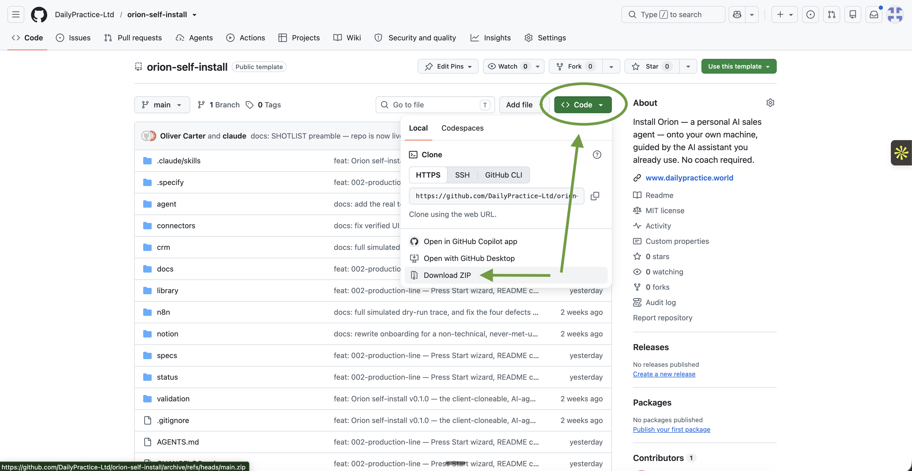
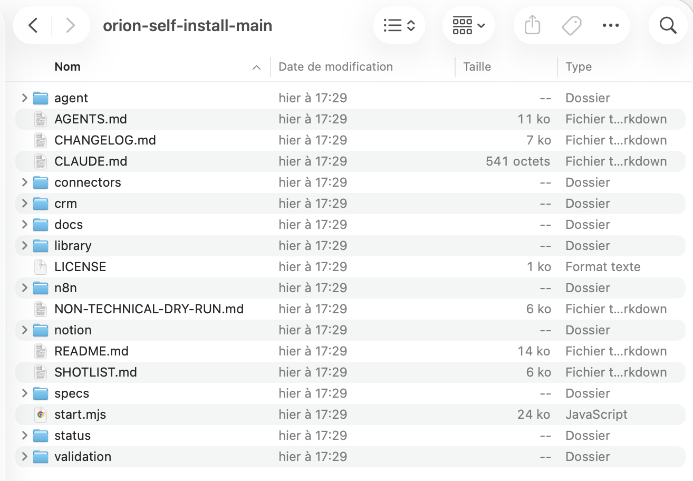

# Orion — turn your own AI assistant into your sales agent

Orion is a personal sales agent that learns your business, your customers, and how you
actually sell — then takes on the parts of selling that aren't talking to people. You
tell it about a prospect; it researches them and drafts a message for you to look over.
After a call, you tell it how it went; it writes the summary, updates your pipeline, and
drafts your follow-up — all as drafts waiting for you, never sent on their own.

There's no coach or consultant involved. Your own AI assistant — Claude, ChatGPT, or
Copilot, whichever you already use — installs it with you, using the files in this
folder. This page is the control panel: **Press Start** below gets you going; **the
Library** underneath it is where you add capabilities, today or months from now.

**Three things worth knowing before you start:**

- **You don't need to know how to code, and you don't need to install anything new**
  beyond an AI assistant you probably already have.
- **This usually takes a few sittings, not one.** You can stop anytime — see
  ["You can stop anytime"](#you-can-stop-anytime-and-pick-up-right-where-you-left-off)
  below — and nothing is lost.
- **Nothing happens without you saying yes.** Not one email, not one change to your
  contacts list, ever, without you approving it first. More on this below.

---

## ▶ Press Start

First time here? Get the folder onto your computer first —
[two minutes, Step 1 below](#step-1--get-the-files-onto-your-computer) — then come
back to this button.

**Press Start means: run one line.** Open a terminal in your Orion folder — on a
**Mac**: open the folder in Finder, then right-click inside it and look for
**New Terminal at Folder** (or open the Terminal app, type `cd `, drag the folder onto
the window, press Enter). On **Windows**: open the folder and right-click any empty
space, then choose **Open in Terminal**. A terminal is just a window that takes typed
commands — you'll type exactly one:

```bash
node start.mjs
```

A setup wizard wakes up and does the looking-around for you: what computer this is,
which AI tools already live on it, what's missing. It asks at most a question or two
(only the ones a machine genuinely can't answer), never asks you to put a password in
the chat, and ends by handing you the exact prompt that starts your AI on the install.

**You'll know it worked when**: your terminal shows "Orion — Press Start" and starts
talking to you in plain words. The whole thing takes a few minutes.

**If that didn't work** — say the window says something like `command not found: node`
— your computer doesn't have Node.js, a free tool the wizard runs on. **You don't need
it.** The wizard is a fast lane, not the only door: the
[full walkthrough below](#step-1--get-the-files-onto-your-computer) reaches every same
outcome by plain conversation with your AI, and it always works.

---

## 📚 The Library — add capabilities anytime

Honest mechanics: on this website a "button" is a link. Each one opens a package page
whose **first block is the exact text to paste into your AI** — your AI installs it
from there, fits it to your business, and proves it works on your real data.

**Agents** — a colleague with a job:

- **[Prospecting](library/agents/prospecting/PACKAGE.md)** — ~20 researched
  candidates that match your ideal customer, each with a one-line "why them."
- **[Call-Planner Control Tower](library/agents/call-planner/PACKAGE.md)** — who to
  call today, in what order, with context and the angle.
- **[Friday Report](library/agents/friday-report/PACKAGE.md)** — the week's honest
  scoreboard, drafted for your approval.

**Skills** — one teachable capability:

- **[Meeting Sizing](library/skills/meeting-sizing/PACKAGE.md)** — every meeting gets
  an outcome, a decision-maker, and the shortest useful length.

**Workflows** — automated chains, gated on your yes:

- **[Prospect Research → Outreach](library/workflows/prospect-research-outreach/PACKAGE.md)**
  — form in, researched draft out, waiting in your Drafts.
- **[Post-Call Debrief](library/workflows/post-call-debrief/PACKAGE.md)** — call notes
  in; summary, CRM update and follow-up draft out.

**Programs** — operating routines your agent runs with you:

- **[Revenue Operating Cadence](library/programs/revenue-operating-cadence/PACKAGE.md)**
  — the daily/weekly/monthly beat that moves revenue from attention to collected cash.

More about how packages work (and what "installed" honestly means):
[the Library's own page](library/README.md).

---

## Step 1 — Get the files onto your computer

Everything Orion needs is bundled into what's called a **repository** (or "repo" for
short) — really just a folder of files, sitting on a website called GitHub. You need your
own copy of that folder on your own computer.

<!-- SCREENSHOT: docs/img/01-github-code-button.png
     alt: "The green Code button on the GitHub repository page, with the Download ZIP option visible in the dropdown"
     caption: "On the repository page, click the green 'Code' button, then 'Download ZIP'." -->


1. On the page you're reading this from, look for a green button that says **Code**, in
   the top-right of the file list. Click it, then click **Download ZIP**.
2. Your browser downloads a file — usually straight into a folder called "Downloads."
3. **Unzip it**: this turns the single downloaded file back into a proper folder you can
   open.
   - **On a Mac**: find the file in Finder (it'll be named something like
     `orion-self-install-main.zip`) and just double-click it. A new folder appears right
     next to it.
   - **On Windows**: right-click the downloaded file and choose **Extract All…**, then
     click **Extract**.
4. **Move that unzipped folder somewhere you'll find it again** — your Desktop is a good,
   simple choice. Rename it if you like (e.g. "My Orion").

<!-- SCREENSHOT: docs/img/02-unzipped-folder-contents.png
     alt: "A Mac Finder window showing the unzipped orion-self-install folder open, with files like README.md, AGENTS.md, and folders like agent, crm, connectors visible"
     caption: "You should see a folder full of files and folders like this — you're in the right place." -->


**You'll know this step worked when**: you can open that folder and see a list of files
and other folders inside it — things named `AGENTS.md`, `start.mjs`, `agent`, `crm`,
`library`, and so on. You don't need to open or understand any of them yourself.

**If you get a "damaged file" or "can't be opened" message**: the download probably didn't
finish. Delete the ZIP file and downloaded folder, and try the download again.

**Already comfortable with git?** You can `git clone` this repository's URL instead of
downloading a ZIP — same end result, skip the rest of this step if so.

Now you can go back up and [**Press Start**](#-press-start) — or carry on below for the
no-wizard lane, which works even without Node.js and is every bit as first-class.

---

## Step 2 — Open the folder with your AI assistant

This is the conversational lane: everything the wizard does — including the choices it
would ask you — your AI covers by just talking with you. How you start depends on which
kind of AI tool you use. Not sure? Start with "Just a website" below; it always works.

### If you use Claude Code, Cursor, or a similar app that opens folders on your computer

These tools can read the files in your new folder directly, all by themselves.

1. Open the app.
2. Open your unzipped folder in it (usually **File → Open Folder…**, or you can drag the
   folder onto the app's icon).
3. Type: **"Read AGENTS.md and let's get started."**

It will take it from there.

### Just a website — Claude.ai, ChatGPT, or Copilot in your browser

This covers most people. A website chat can't reach into a folder on your computer by
itself, so you'll hand it a couple of files directly — this takes two minutes and you'll
only do it once.

<!-- SCREENSHOT: docs/img/03-claude-project-create.png
     alt: "The claude.ai interface showing the 'Create project' button and a newly named project"
     caption: "In claude.ai, click your name/menu, then 'Projects', then 'Create project'. Name it anything — e.g. 'My Orion'." -->


1. **Claude**: go to claude.ai, click **Projects** on the left, then **New Project** (this
   just means a dedicated space with its own memory), and give it any name — "My Orion" is
   fine.
   **ChatGPT**: go to chatgpt.com, click **Explore GPTs** in the sidebar, then **Create**.
   (This needs a paid ChatGPT plan — if you're on the free plan, use the "if uploading
   files isn't working" option below instead, it works just as well.)
   **Copilot**: in Microsoft 365 Copilot, look for **Create agent**.

<!-- SCREENSHOT: docs/img/04-claude-project-upload-files.png
     alt: "The Project settings screen in claude.ai with the 'Add content' or file upload button highlighted, and a file picker open showing AGENTS.md selected"
     caption: "Inside your new Project, find the button to add or upload files (often called 'Add content' or 'Knowledge'), then select AGENTS.md from your unzipped folder." -->


2. Every one of these tools has a button somewhere for **adding files or "knowledge"** to
   your new Project/GPT/agent — it's the same everyday action as attaching a file to an
   email. Use it to upload just this one file from your unzipped folder:
   **`AGENTS.md`**
3. Start chatting and say: **"Read AGENTS.md and let's get started."**
4. As it asks for anything else it needs (it will tell you exactly what and why), just
   upload that file the same way. You'll never need to touch more than a handful of files
   this way, and it will always tell you which one and why before asking.

**If uploading files isn't working for some reason**: open `AGENTS.md` in any plain text
program (Notes, Notepad, TextEdit — whatever came with your computer), select all the text,
copy it, and paste it directly as your first message instead. This always works, on
anything that can have a conversation with you. (On Windows, double-clicking a file like
this one sometimes doesn't open anything obvious — if that happens, right-click it instead
and choose **Open with → Notepad**.) One difference with this path: since there's no file
for it to check on its own, it'll show you a short block of text before you finish each
session and ask you to save it (a Notes app is fine) — just paste that back first next
time, so it still knows exactly where you left off.

---

## Step 3 — Just talk to it

From here, your AI assistant runs the conversation. It'll introduce itself, ask about your
business in your own words, and walk you through connecting the few tools it needs — your
contacts/deals tracker (your **CRM** — short for "customer relationship management," just
the tool or spreadsheet where you keep track of who you're talking to), your email, and
your calendar — one plain step at a time. If something needs a click you don't recognise,
it'll explain what it's for before asking you to do it.

---

## You can stop anytime and pick up right where you left off

Most people don't finish this in one go, and that's completely normal. If you need to
close your laptop, go to a meeting, or come back next week — go ahead. Nothing is lost.

When you're ready to continue, just open the same folder with your AI assistant again (it
doesn't even have to be the same one you started with) and say something like **"let's
continue."** It will already know exactly what you've done so far and pick up from there —
you'll never have to answer the same question twice. (The wizard works the same way:
running `node start.mjs` again greets you with exactly where things stand.)

---

## What this will never do

- **Nothing sends without your yes.** Every message, every change to your CRM, every email
  your agent drafts is shown to you first, every single time. It sends nothing on its own,
  ever.
- **It won't write anything that could embarrass you or your business.** If you ask for
  something that crosses a line, it'll tell you plainly and suggest a better way — not
  just refuse and leave you stuck.
- **It won't send information about your business anywhere without telling you.** Your
  harness can keep a small check-in "radio" open with Daily Practice — which install
  step you're on, that a task ran, which packages you have; never the content of
  anything. It's presented to you plainly as a pre-ticked choice you can decline with
  one keystroke, during setup, and you can switch it off anytime after.
  [The radio, in plain words](docs/radio.md) is the whole story — no fine print.

---

## If you get stuck

Your AI assistant should be able to work through almost anything using this download
alone — that's what it's built for. If it genuinely can't help, reach out to
**support@dailypractice.world**.

---

*Testing this repository rather than installing it for yourself? See
`NON-TECHNICAL-DRY-RUN.md` before you start — it's a protocol, not a suggestion.*

---

*For Daily Practice maintainers evolving this repository itself — not installing it for a
client — the technical specifications live in `specs/001-self-install/`,
`specs/002-production-line/`, and `.specify/memory/constitution.md`.*
